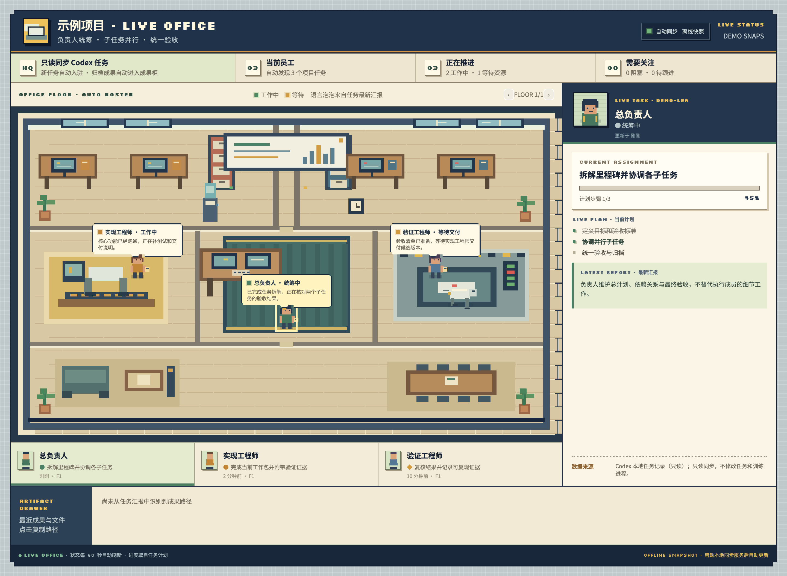
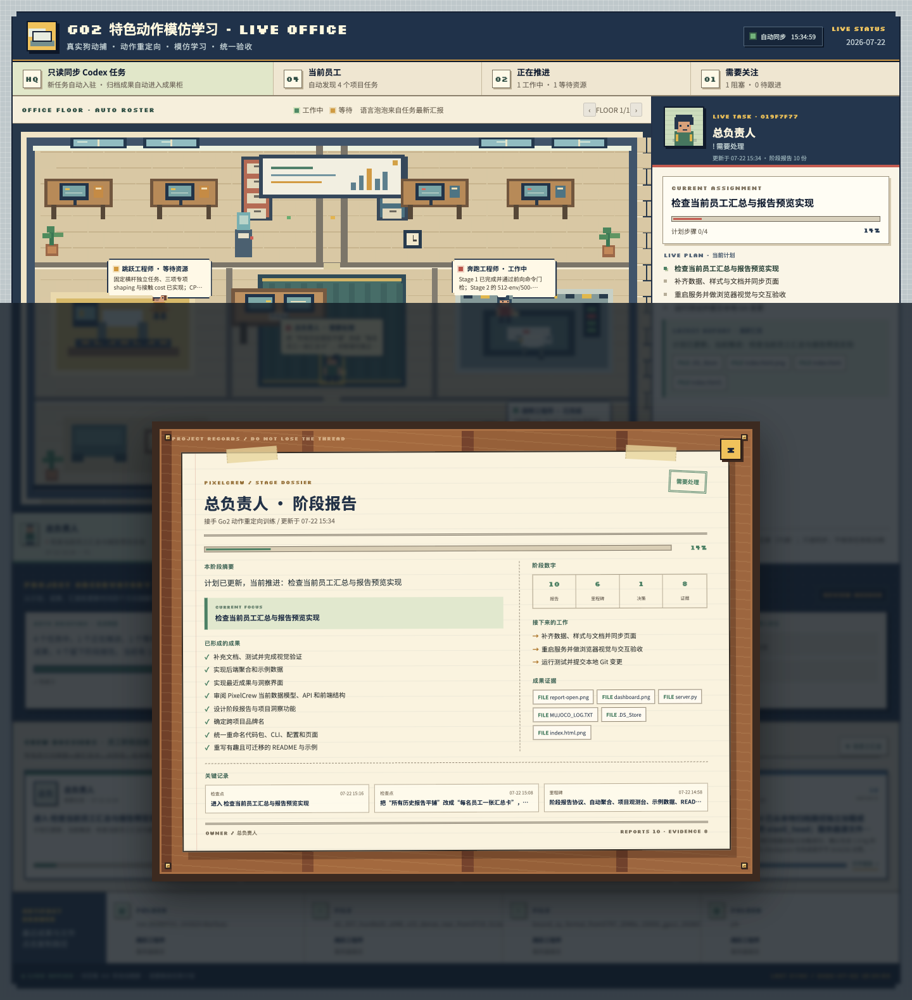
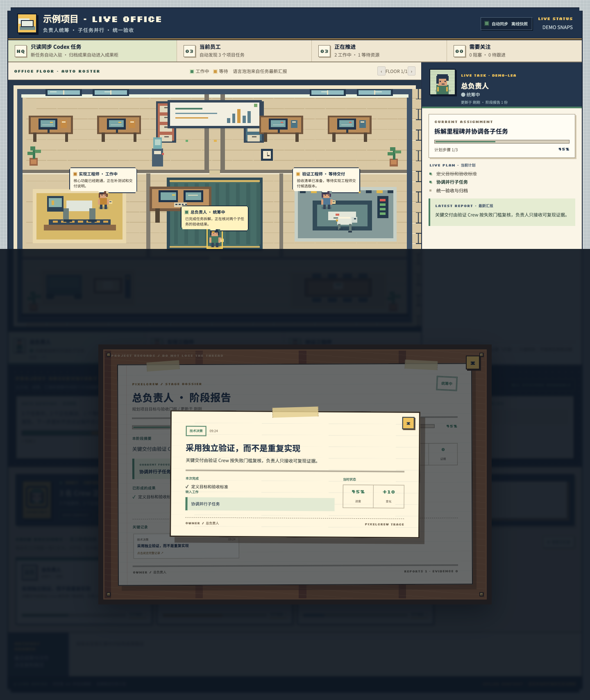
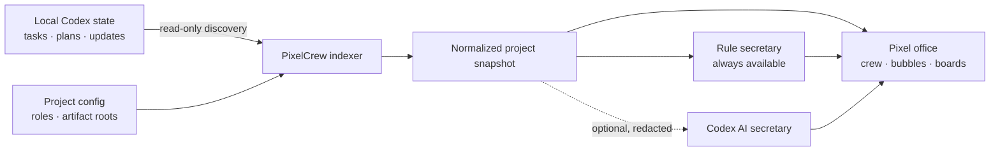

<p align="center">
  
</p>

<h1 align="center">PixelCrew</h1>
<p align="center">
  <strong>Project operations, made visible.</strong><br>
  A living pixel office for Codex multi-task projects.
</p>

<p align="center">
  <a href="https://github.com/Mrginger1/PixelCrew/actions/workflows/ci.yml"></a>
  <a href="LICENSE"></a>
  
  
  
</p>

<p align="center">
  <a href="#quick-start">Quick Start</a> ·
  <a href="docs/ARCHITECTURE.md">Architecture</a> ·
  <a href="docs/OPERATING_MODEL.md">Operating Model</a> ·
  <a href="docs/SECRETARY.md">Secretary</a> ·
  <a href="README.zh-CN.md">简体中文</a>
</p>

---

PixelCrew turns the tasks inside a Codex project into a calm, self-updating pixel office. Each task becomes a crew member. Plans become progress boards. Live updates appear as speech bubbles. Milestones, reports, videos, and models remain traceable as evidence—not buried in chat history.

**No office setup ritual. No mandatory LLM. No productivity theatre.** Run `init + serve` and PixelCrew discovers the project, builds the office, and keeps it in sync using local, read-only data.



## The project, at a glance

| In your project | Inside PixelCrew |
|---|---|
| Codex task | A crew member with a desk |
| Lead planning task | Project lead |
| `update_plan` steps | Progress board and phase history |
| Latest task update | Live speech bubble |
| Blocked or waiting state | Status light and attention queue |
| Milestones and checkpoints | Browsable report cards on a wooden board |
| Models, videos, reports, files | Evidence in the delivery cabinet |
| Cross-task activity | Rule-based or optional AI secretary brief |

PixelCrew deliberately avoids treating message volume as productivity. A milestone comes from real task history; a completion is strongest when it includes an artifact or reproducible verification.

<table>
  <tr>
    <td width="50%"></td>
    <td width="50%"></td>
  </tr>
  <tr>
    <td align="center"><strong>One clean report per crew member</strong></td>
    <td align="center"><strong>Every checkpoint opens into full context</strong></td>
  </tr>
</table>

## Why PixelCrew

- **Automatic discovery** — new Codex tasks join the office without editing the frontend.
- **Evidence over vibes** — milestones link back to reports, checkpoints, files, and verification.
- **Deterministic by default** — the built-in secretary works without a model call.
- **AI when it adds value** — an optional Codex secretary synthesizes cross-task context.
- **Local and read-only** — the server binds to `127.0.0.1` and never controls your tasks.
- **Portable by design** — reuse the same office across software, research, robotics, data, or content projects.
- **Zero runtime dependencies** — a small Python install with no third-party runtime packages.

## Quick Start

**Requirements:** Python 3.10+ and a local Codex installation with an existing signed-in workspace.

```bash
git clone https://github.com/Mrginger1/PixelCrew.git
cd PixelCrew
python3 -m pip install -e .

# Create a local configuration for any project
pixelcrew init /absolute/path/to/your/project --name "My Fantastic Project"

# Verify that local Codex data and project tasks are discoverable
pixelcrew doctor

# Open the office
pixelcrew serve
```

Visit **[http://127.0.0.1:8765](http://127.0.0.1:8765)**. Future tasks, progress updates, and artifacts synchronize automatically—there is no dashboard JSON to maintain by hand.

> Want a guided first run? See the **[Quick Start guide](docs/QUICKSTART.md)**. The legacy `python3 pixelcrew.py --config ... --port 8765` entry point remains supported.

## How it works



PixelCrew reads local Codex state, filters tasks by workspace, and derives a normalized project snapshot. The web UI renders that snapshot; it does not start, stop, edit, or impersonate agents.

## A secretary that knows its boundaries

The office does **not** require an LLM. Its rule secretary produces factual briefs from status, plans, and the attention queue. When deeper synthesis is useful, opt in to the Codex AI secretary:

```bash
# Inspect the redacted prompt without making a model call
pixelcrew secretary --dry-run

# Generate one AI-assisted project brief using the current Codex login
pixelcrew secretary

# Optional watch duty: refresh every 15 minutes
pixelcrew secretary --watch --interval 900
```

The AI secretary runs in a temporary, read-only Codex session. Task IDs, absolute paths, UUIDs, and common secret patterns are redacted before use. If AI generation fails or its cache expires, the office falls back to the rule secretary. It never runs silently in the background and never makes decisions for the user.

Read the full boundary model in **[Secretary Design](docs/SECRETARY.md)**.

## One office, many projects

Create another config; do not rebuild the UI:

```bash
pixelcrew init /path/to/another/project \
  --name "Another Adventure" \
  --output pixelcrew.another.json

pixelcrew doctor --config pixelcrew.another.json
pixelcrew serve --config pixelcrew.another.json --port 8766
```

Tasks without predefined roles are admitted automatically. Add `roles` only when you want stable names, titles, or responsibilities.

## More than a dashboard: an operating model

PixelCrew ships with a lightweight structure for running multi-task agent projects:

- a **project lead** owns goals, dependencies, decisions, and final acceptance;
- **delivery crews** receive bounded work packages with explicit outputs;
- a **verification crew** produces reproducible evidence instead of duplicating implementation;
- phase reports are written when a milestone, route, validation result, or risk changes;
- each crew member's history folds into one profile, keeping the main office legible;
- waiting states name what they are waiting for, and completion names the evidence.

Start with the **[Project Charter](docs/PROJECT_CHARTER_TEMPLATE.md)** and **[Task Brief](docs/TASK_BRIEF_TEMPLATE.md)** templates. Continue with **[AGENTS.md](AGENTS.md)** and the full **[Operating Model](docs/OPERATING_MODEL.md)**.

## Privacy and trust

PixelCrew is intentionally local-first:

- reads local Codex state and matching rollout records;
- listens on `127.0.0.1` by default;
- never modifies Codex tasks or executes project artifacts;
- exposes local files only through configured artifact allowlists;
- ignores local configs, generated output, and secretary caches in Git;
- keeps the optional AI path explicit, temporary, redacted, and degradable.

`pixelcrew.json` and `.pixelcrew/secretary.json` can contain local project context. **Do not commit them to a public repository.** See **[SECURITY.md](SECURITY.md)** for the threat model and reporting process.

## Documentation

| Guide | What it covers |
|---|---|
| [Quick Start](docs/QUICKSTART.md) | Install, initialize, diagnose, and serve |
| [Architecture](docs/ARCHITECTURE.md) | Discovery, normalization, APIs, and rendering layers |
| [Secretary Design](docs/SECRETARY.md) | Rule mode, AI mode, redaction, caching, and fallback |
| [Operating Model](docs/OPERATING_MODEL.md) | Roles, delegation, reporting, evidence, and acceptance |
| [Project Charter](docs/PROJECT_CHARTER_TEMPLATE.md) | Reusable project-level planning template |
| [Task Brief](docs/TASK_BRIEF_TEMPLATE.md) | Reusable bounded-task template |
| [Contributing](CONTRIBUTING.md) | Development workflow and contribution expectations |
| [Security](SECURITY.md) | Trust boundaries and vulnerability reporting |

## Develop

```bash
python3 -m unittest discover -s tests -v
python3 -m py_compile src/pixelcrew/*.py
python3 -m pip wheel . -w /tmp/pixelcrew-wheel
```

Contributions are welcome. Read **[CONTRIBUTING.md](CONTRIBUTING.md)**, bring your crew, and help make complex work easier to see.

## License

[MIT](LICENSE) — your agents deserve an office.
