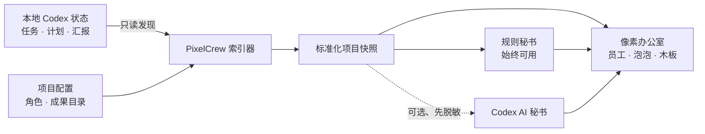

<p align="center">
  
</p>

<h1 align="center">PixelCrew</h1>
<p align="center">
  <strong>让项目运转，看得见。</strong><br>
  面向 Codex 多任务项目的实时像素办公室。
</p>

<p align="center">
  <a href="https://github.com/Mrginger1/PixelCrew/actions/workflows/ci.yml"></a>
  <a href="LICENSE"></a>
  
  
  
</p>

<p align="center">
  <a href="#三分钟入驻">快速开始</a> ·
  <a href="docs/ARCHITECTURE.md">系统架构</a> ·
  <a href="docs/OPERATING_MODEL.md">协作模型</a> ·
  <a href="docs/SECRETARY.md">秘书机制</a> ·
  <a href="README.md">English</a>
</p>

---

PixelCrew 把同一个 Codex 项目里的任务变成一间安静、会自动更新的像素办公室：每项任务是一名员工，计划变成工位进度，最新工作出现在语言泡泡里，里程碑、报告、视频和模型则作为可追溯证据留在成果柜中，不再淹没于聊天记录。

**不用手工搭办公室，不强制调用 LLM，也不制造虚假的忙碌感。** 运行 `init + start`，PixelCrew 就会基于本地只读数据发现项目、生成办公室并持续同步。


## 一眼看清整个项目

| 真实项目 | PixelCrew 世界 |
|---|---|
| Codex 项目任务 | 一名拥有工位的 Crew |
| 总规划任务 | 项目负责人 |
| `update_plan` | 工位进度与阶段历史 |
| 最新任务汇报 | 人物语言泡泡 |
| 阻塞或等待 | 状态灯与关注队列 |
| 里程碑与检查点 | 木板上可逐条翻阅的报告卡 |
| 模型、视频、报告、文件 | 成果柜中的交付证据 |
| 跨任务态势 | 规则秘书或可选 AI 秘书简报 |

PixelCrew 不把消息数量当作生产力。阶段成果来自真实任务记录；“完成”最好同时包含可检查的文件或可复现的验证证据。

<table>
  <tr>
    <td width="50%"></td>
    <td width="50%"></td>
  </tr>
  <tr>
    <td align="center"><strong>每名员工只有一张清晰汇总</strong></td>
    <td align="center"><strong>每个检查点都能打开完整上下文</strong></td>
  </tr>
</table>

## 为什么选择 PixelCrew

- **任务自动入驻**：新增 Codex 任务无需修改网页，办公室会自动发现。
- **用证据说话**：里程碑可以追溯到报告、检查点、文件和验证结果。
- **默认确定性**：内置规则秘书完全不需要模型调用。
- **AI 只用在值得的地方**：可选 Codex 秘书负责跨任务语境综合。
- **本地、只读**：服务默认只监听 `127.0.0.1`，不会控制你的任务。
- **跨项目迁移**：软件、科研、机器人、数据分析或内容项目均可复用。
- **运行时零依赖**：纯 Python 小型安装，没有第三方运行时包。

## 三分钟入驻

**环境要求：** Python 3.10+，本机已安装并登录 Codex，且存在可读取的项目工作区。

```bash
git clone https://github.com/Mrginger1/PixelCrew.git
cd PixelCrew
python3 -m pip install -e .

# 为任意项目创建本地配置
pixelcrew init /absolute/path/to/your/project --name "My Fantastic Project"

# 检查 Codex 本地数据以及任务发现是否正常
pixelcrew doctor

# 后台稳定启动、检查状态并打开办公室
pixelcrew start
pixelcrew status
pixelcrew open
```

PixelCrew 会打开 **[http://127.0.0.1:8765](http://127.0.0.1:8765)**。此后新增任务、进度和成果会自动同步，不需要手工维护看板 JSON。

> 希望一步步体验？阅读 **[快速入门](docs/QUICKSTART.md)**。旧版入口 `python3 pixelcrew.py --config ... --port 8765` 仍保持兼容。

## 工作原理



PixelCrew 读取 Codex 本地状态，按工作区筛选任务，并生成标准化项目快照。Web 界面只负责展示，不会启动、停止、修改或冒充任何 Agent。

## 一位懂边界的秘书

办公室本身**不依赖 LLM**。规则秘书根据状态、计划和关注队列生成事实简报；需要更深入的跨任务总结时，再主动开启 Codex AI 秘书：

```bash
# 查看脱敏后将送入模型的内容，不发起模型调用
pixelcrew secretary --dry-run

# 使用当前 Codex 登录生成一次 AI 项目简报
pixelcrew secretary

# 可选值班模式：每 15 分钟刷新
pixelcrew secretary --watch --interval 900
```

AI 秘书运行在临时、只读的 Codex 会话中。任务 ID、绝对路径、UUID 和常见密钥格式会先被脱敏。AI 生成失败或缓存过期时，界面自动回退到规则秘书。它不会静默地在后台调用模型，也不会代替用户做决定。

完整边界设计见 **[秘书机制](docs/SECRETARY.md)**。

## 一间办公室，适配多个项目

创建另一份配置即可，不必重新开发页面：

```bash
pixelcrew init /path/to/another/project \
  --name "Another Adventure" \
  --output pixelcrew.another.json

pixelcrew doctor --config pixelcrew.another.json
pixelcrew start --config pixelcrew.another.json --port 8766
pixelcrew open --config pixelcrew.another.json
# 稍后停止：pixelcrew stop --config pixelcrew.another.json
```

未预设角色的新任务同样会自动入驻。只有在需要稳定昵称、职位或职责时，才需要配置 `roles`。

## 不只是看板，更是一套协作架构

PixelCrew 同时提供一套轻量的多任务 Agent 工作模型：

- **项目负责人**持有目标、依赖关系、路线决策和最终验收权；
- **执行 Crew**接收边界明确、可独立交付的工作包；
- **验证 Crew**不重复实现，只提交可复现的验证证据；
- 仅在里程碑、路线、验证结论或风险发生变化时写阶段报告；
- 每名员工的多段历史收拢为一张档案，首页始终保持清晰；
- 等待要写明等待对象，阻塞要写清解锁条件，完成必须说明证据。

可以从 **[项目章程模板](docs/PROJECT_CHARTER_TEMPLATE.md)** 与 **[任务简报模板](docs/TASK_BRIEF_TEMPLATE.md)** 开始，再阅读 **[AGENTS.md](AGENTS.md)** 和完整的 **[协作模型](docs/OPERATING_MODEL.md)**。

## 隐私与信任边界

PixelCrew 从设计上坚持本地优先：

- 仅读取本地 Codex 状态及对应的 rollout 记录；
- 默认监听 `127.0.0.1`；
- 不修改 Codex 任务，也不执行项目成果文件；
- 本地文件必须位于配置的成果白名单中才会展示；
- 本地配置、生成内容和秘书缓存均默认被 Git 忽略；
- AI 路径始终显式、临时、先脱敏，并且可以安全降级。

`pixelcrew.json` 和 `.pixelcrew/secretary.json` 可能包含本地项目语境，**不要将它们提交到公开仓库**。威胁模型与安全报告方式见 **[SECURITY.md](SECURITY.md)**。

## 文档导航

| 文档 | 内容 |
|---|---|
| [快速入门](docs/QUICKSTART.md) | 安装、初始化、诊断与本地服务管理 |
| [系统架构](docs/ARCHITECTURE.md) | 任务发现、数据标准化、API 与渲染分层 |
| [秘书机制](docs/SECRETARY.md) | 规则模式、AI 模式、脱敏、缓存与降级 |
| [协作模型](docs/OPERATING_MODEL.md) | 角色、任务拆解、阶段报告、证据与验收 |
| [产品工作台](docs/product/README.md) | PRD、独立评审、路线图与需求迭代流程 |
| [项目章程](docs/PROJECT_CHARTER_TEMPLATE.md) | 可复用的项目级规划模板 |
| [任务简报](docs/TASK_BRIEF_TEMPLATE.md) | 可复用的边界化子任务模板 |
| [贡献指南](CONTRIBUTING.md) | 开发流程与贡献约定 |
| [安全说明](SECURITY.md) | 信任边界与漏洞报告 |

## 开发与验证

```bash
python3 -m unittest discover -s tests -v
python3 -m py_compile src/pixelcrew/*.py
python3 -m pip wheel . -w /tmp/pixelcrew-wheel
```

欢迎贡献。阅读 **[CONTRIBUTING.md](CONTRIBUTING.md)**，带上你的 Crew，一起让复杂项目变得更清晰。

## 许可证

[MIT](LICENSE) — 给你的 Agents 盖一栋真正好用的办公室。
