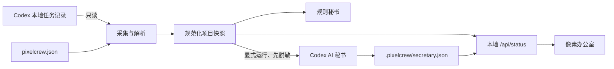

# PixelCrew 架构

## 设计原则

1. **采集确定性**：办公室不依赖 LLM 才能建立或更新。
2. **只读优先**：不向 Codex 状态库写入，不控制任务生命周期。
3. **可选智能**：LLM 只负责跨任务归纳，失败不影响主界面。
4. **证据优先**：进度来自计划、阶段记录和交付物，不来自消息数量。
5. **项目可迁移**：项目差异只进入配置与采集适配层，前端保持通用。

## 数据流

## 组件

- `server.py`：配置默认值、Codex 状态采集、rollout 解析、进度/成果/阶段报告聚合和只读 HTTP 服务。
- `secretary.py`：规则简报、模型输入脱敏、临时只读 Codex 调用和原子缓存。
- `cli.py`：`init`、`doctor`、`snapshot`、`start/status/open/stop`、`serve`、`secretary`。
- `web/index.html`：无构建步骤的单页办公室，包含员工档案和记录详情弹窗。
- `web/icon.svg`：站点 favicon 与像素秘书头像。

## 状态模型

一个 Codex 任务映射为一名 Crew。结构化计划计算进度；带说明的计划变化形成阶段记录；允许路径中的文件形成成果证据。项目层汇总计划覆盖、证据覆盖、报告覆盖、信息新鲜度和关注队列。

## 适配其他任务系统

稳定边界是 `Dashboard.snapshot()` 返回的数据结构。要接入非 Codex 系统，可新增采集适配器并产出相同的 employee、plan、stageReports、artifacts 字段；前端、规则秘书与 AI 秘书无需重写。

## 兼容性风险

Codex SQLite 和 rollout 是本地实现细节，未来可能变化。解析失败应降级为空字段而非写回或修复源数据；使用 `pixelcrew doctor` 尽早发现版本不兼容。
