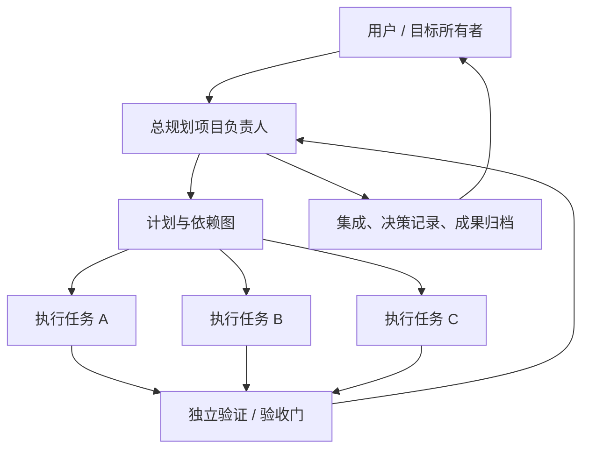
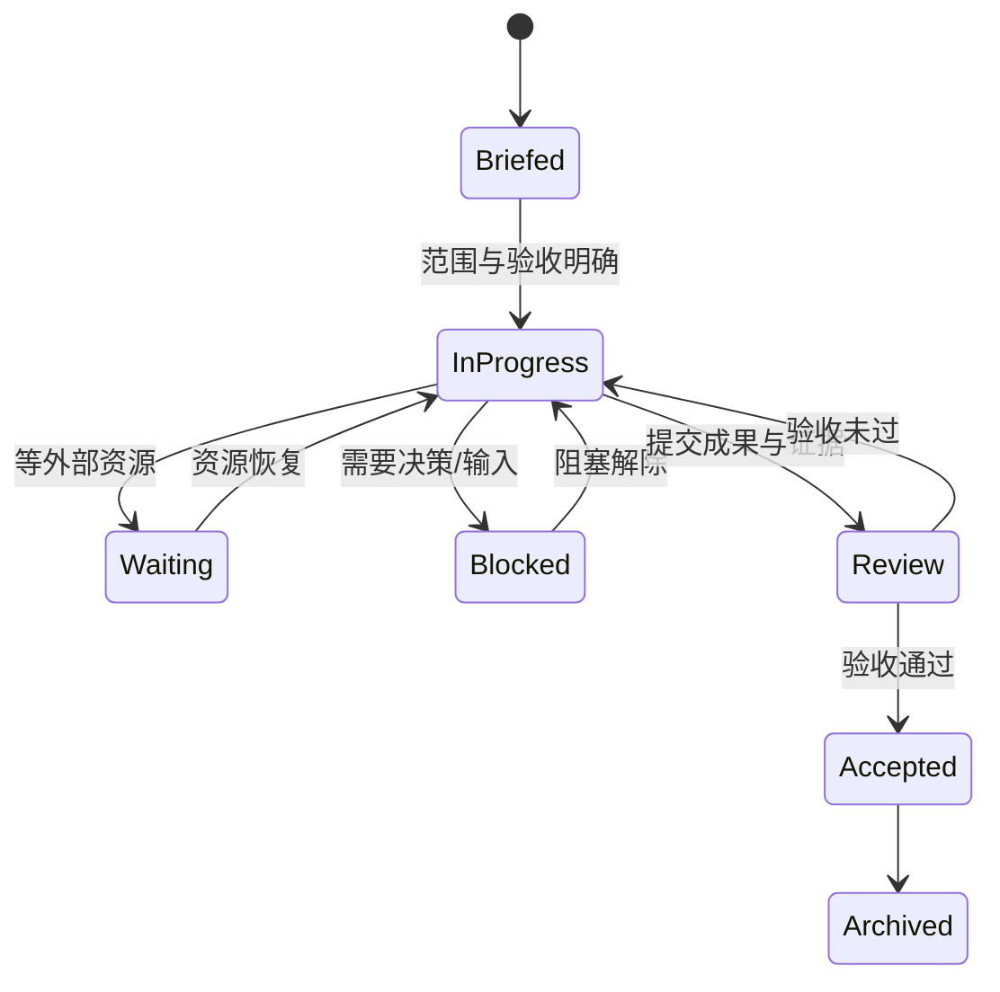

# Agent 项目工作架构

## 1. 组织结构

总负责人拥有“目标和验收”，执行成员拥有“有界工作包”，验证成员拥有“独立证据”。

## 2. 五层信息模型

1. **Project Charter**：为什么做、完成定义、硬约束。
2. **Milestones**：能向用户展示的阶段结果。
3. **Work Packages**：可由一个任务独立完成的最小交付单元。
4. **Evidence**：测试、截图、视频、模型、报告、指标链接。
5. **Decision Log**：岔路选择、否决原因和后续影响。

## 3. 任务拆解规则

只有同时满足以下条件才适合拆为并行任务：

- 输出可独立验收；
- 写入范围不与其他任务冲突；
- 输入已知，不依赖尚未得到的关键结果；
- 失败不会破坏主线；
- 负责人可以用明确证据复核。

紧急关键路径、强耦合设计和下一步立即依赖的工作保留在负责人任务中。

## 4. 生命周期

## 5. 汇报节奏

- 开始：一句话说明当前动作和验收门。
- 中途：只在状态、风险或计划改变时汇报。
- 等待：写清等待什么，不制造虚假进度。
- 完成：使用 AGENTS.md 的强制交接格式。
- 负责人：整合后向用户汇报结论，不简单转发所有日志。

## 6. 看板如何映射

- 一个 Codex 项目任务 = 一名员工。
- `update_plan` = 结构化进度条与当前工作。
- 最新计划说明/最终汇报 = 人物语言泡泡。
- 文件、模型、视频、报告路径 = 成果柜。
- 新任务自动入驻；每 6 人自动增加一层办公室。
- 看板只读，不负责启动或终止任务。
