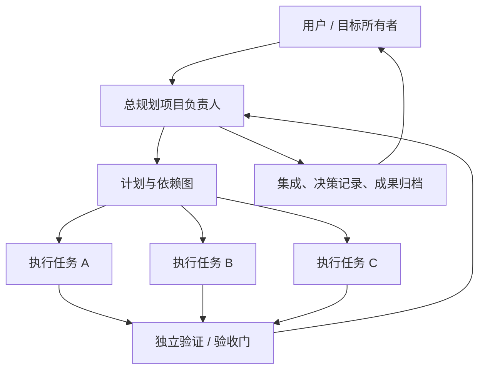
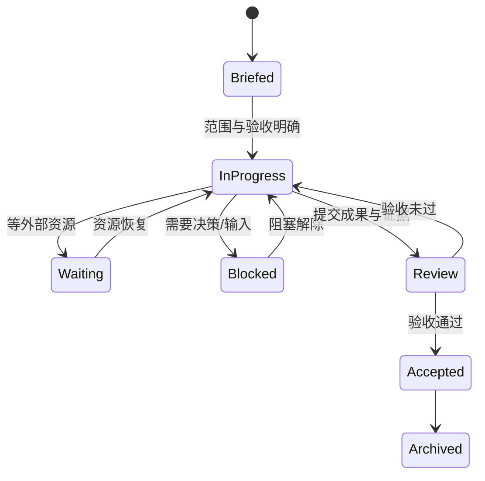

# PixelCrew 工作架构

## 1. 组织结构

总负责人拥有“目标和验收”，执行成员拥有“有界工作包”，验证成员拥有“独立证据”。

## 2. 五层信息模型

1. **Project Charter**：为什么做、完成定义、硬约束。
2. **Milestones**：能向用户展示的阶段结果。
3. **Work Packages**：可由一个任务独立完成的最小交付单元。
4. **Evidence**：测试、截图、视频、模型、报告、指标链接。
5. **Decision Log**：岔路选择、否决原因和后续影响。

## 3. 任务拆解规则

只有同时满足以下条件才适合拆为并行任务：

- 输出可独立验收；
- 写入范围不与其他任务冲突；
- 输入已知，不依赖尚未得到的关键结果；
- 失败不会破坏主线；
- 负责人可以用明确证据复核。

紧急关键路径、强耦合设计和下一步立即依赖的工作保留在负责人任务中。

## 4. 生命周期

## 5. 汇报节奏

- 开始：一句话说明当前动作和验收门。
- 中途：只在状态、风险或计划改变时汇报。
- 等待：写清等待什么，不制造虚假进度。
- 完成：使用 AGENTS.md 的强制交接格式。
- 负责人：整合后向用户汇报结论，不简单转发所有日志。

## 6. 看板如何映射

- 一个 Codex 项目任务 = 一名员工。
- `update_plan` = 结构化进度条与当前工作。
- 最新计划说明/最终汇报 = 人物语言泡泡。
- 文件、模型、视频、报告路径 = 成果柜。
- 新任务自动入驻；每 6 人自动增加一层办公室。
- 看板只读，不负责启动或终止任务。

## 7. 阶段报告与项目观测

阶段报告不是日报，也不是聊天摘要。它只记录会改变项目理解的事件：里程碑完成、验证结果、路线决策、风险变化和外部等待。执行成员通过带 `explanation` 的 `update_plan` 提交，PixelCrew 自动保留当时的计划进度、刚完成步骤、当前步骤和待办数量。

项目观测台从所有任务聚合四类信号：

- **计划推进**：跨任务结构化步骤的完成比例；
- **成果证据**：已有文件、模型、视频、报告或数据的任务覆盖率；
- **阶段汇报**：留下可追溯阶段报告的任务覆盖率；
- **信息新鲜度**：24 小时内仍有更新的任务覆盖率。

关注队列只展示可验证的缺口，例如阻塞、超时、等待、无计划或“完成但没有成果证据”。它不预测虚假的完成日期，也不把消息数量当作生产力。

## 8. 项目秘书与负责人分工

项目秘书聚合信息，项目负责人拥有决策权。规则秘书从结构化状态产生基础简报；可选 AI 秘书只在用户显式调用后跨任务归纳依赖和风险。秘书不得创建虚假 ETA、替代验收或自动执行建议动作。

推荐节奏：Crew 在关键节点提交阶段报告 → 看板确定性同步 → 秘书形成跨任务简报 → 负责人查看可展开的原始检查点和证据 → 负责人决策并更新总计划。这样既获得信息广度，又保留每项结论的可追溯深度。

## 9. 项目迁移规则

迁移到新项目时，不复制旧员工和状态，只复用架构：

1. 为新根目录运行 `pixelcrew init`；
2. 用 `doctor` 验证发现范围；
3. 可选指定负责人和稳定角色名；
4. 复制 Charter 与任务简报模板，而不是复制真实任务 ID；
5. 保持成果白名单和秘书缓存位于新项目内部；
6. 启动 `serve` 后让新任务自动入驻。
