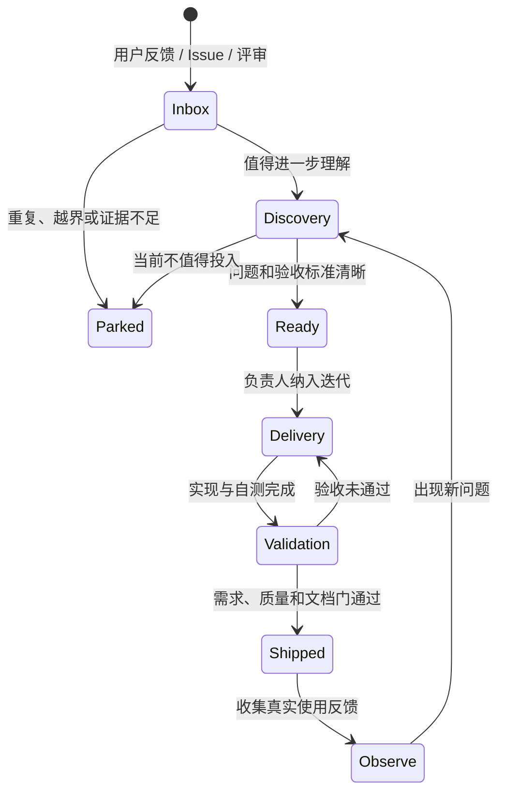

# 需求迭代流程

## 1. 状态机

状态表示决策成熟度，不表示“忙碌程度”。没有证据的需求可以长期停在 `Inbox` 或 `Parked`，不应伪装成开发中。

## 2. 需求入口

- GitHub 功能建议与缺陷模板；
- 用户直接反馈；
- 产品、UX、工程与安全评审；
- 安装、`doctor`、运行和浏览成果时出现的可复现摩擦；
- 新 Codex 版本造成的兼容性变化。

不得默认上传任务内容、路径或使用遥测。公开 issue 中不得包含真实任务 ID、私有绝对路径、令牌或项目快照。

## 3. Definition of Ready

进入 `Ready` 前必须满足：

- 问题场景、目标用户和证据明确；
- 期望结果可以观察，验收标准可以执行；
- 范围与非目标明确；
- 已检查 local-first、read-only、可选 AI 和隐私边界；
- 主要依赖、维护成本和兼容性风险已知；
- 项目负责人确认可以拆成有界工作包。

## 4. 优先级

- **P0**：阻止安装、启动、核心状态理解或造成隐私/数据边界风险的问题。
- **P1**：显著改善主要用户旅程、证据追溯或跨任务决策质量的问题。
- **P2**：有价值但不影响核心任务的增强、视觉精修或生态扩展。

同一等级内比较四项：用户价值、证据强度、实现/维护成本、风险降低。分数只帮助讨论，不代替负责人判断。

## 5. 每轮迭代

1. 产品负责人从 `Ready` 中提出 1–3 个结果目标。
2. 项目负责人确定依赖、工作包、验证任务和明确非目标。
3. 执行 Crew 在关键变化时提交阶段报告，而不是机械日报。
4. 验证 Crew 按需求验收标准复核，并检查回归与安全边界。
5. 负责人整合结论；产品负责人判断用户问题是否真正缓解。
6. 发布后记录结果和新反馈，再决定继续、调整或停止。

## 6. Definition of Done

需求只有同时满足以下条件才可进入 `Shipped`：

- 所有验收标准有对应证据；
- 自动测试通过，并完成必要的浏览器/人工体验验证；
- 安全与隐私边界未退化；
- 文档、示例和迁移说明已同步；
- 向后兼容性已验证，或破坏性变化被明确说明；
- 产品负责人记录结果，项目负责人给出最终验收结论。

## 7. 发布复盘

每项发布需求只记录四类结果之一：

- **达到**：证据表明预期用户结果已实现；
- **部分达到**：核心结果改善，但仍有明确缺口；
- **未达到**：功能存在，但用户问题没有被解决；
- **取消**：证据或约束变化后不再值得继续。

禁止用代码行数、提交数量或 Agent 消息数作为产品成功指标。
