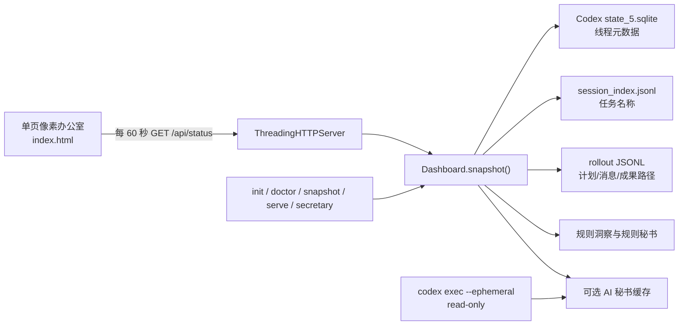
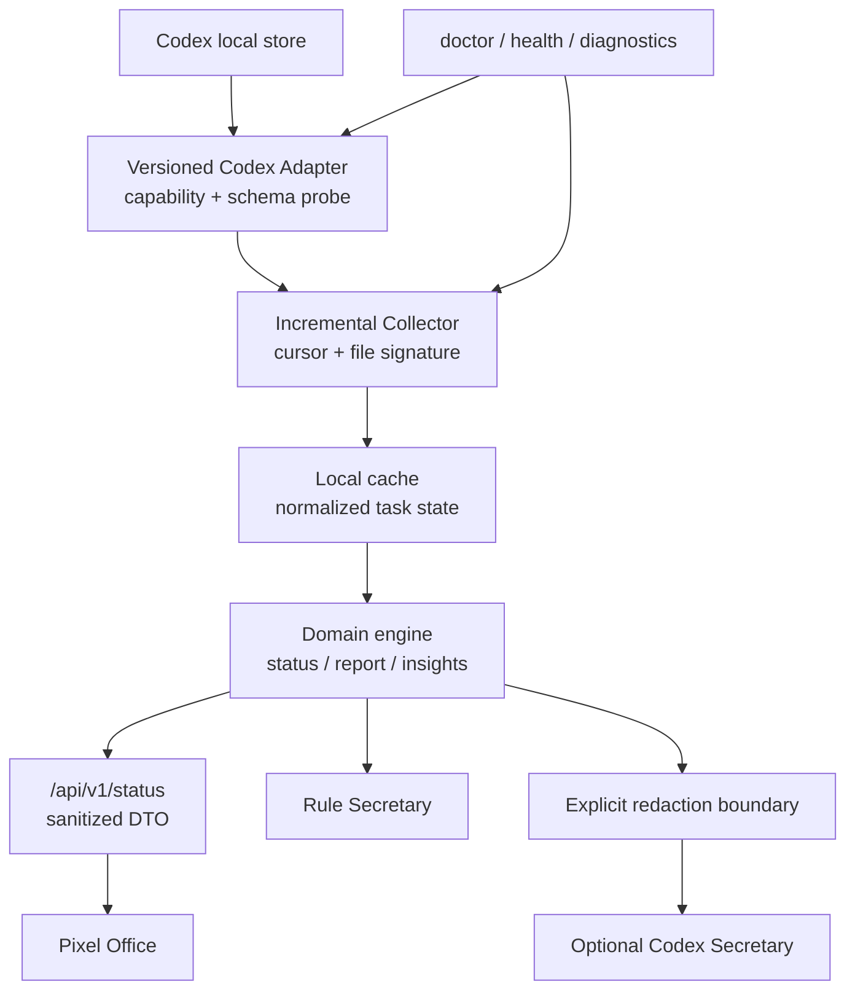

# PixelCrew 独立技术评审

> 评审日期：2026-07-24
> 评审基线：`main@874a2c5`，PixelCrew `0.3.0`
> 评审范围：架构、测试、CLI、Codex 数据发现、隐私安全、部署方式、跨项目迁移性
> 评审性质：基于源码、现有 CI、单元测试和本机运行样本的独立工程评审；不评价像素美术质量。

## 1. 执行摘要

PixelCrew 已经证明了一个有价值的产品假设：**无需要求 Agent 额外填报，也能从 Codex 本地记录中自动还原“谁在做什么、做到哪一步、留下了什么证据”**。当前实现保持零运行时依赖、默认只读、默认绑定回环地址，并提供规则秘书和显式启用的 Codex AI 秘书，作为个人本地工具的早期 Alpha 已可用。

但它尚不应被定义为“可长期无人值守、适配任意 Codex 版本、可安全远程访问”的通用项目基础设施。当前最重要的工程问题不是再增加面板或秘书功能，而是以下四项：

1. **数据采集为全量重扫**：每次 `/api/status` 都重新读取所有匹配任务的完整 rollout，开销随历史长度线性增长，并会被多浏览器/多请求放大。
2. **直接耦合 Codex 私有存储细节**：固定依赖 `state_5.sqlite`、`threads` 表字段、`session_index.jsonl` 和 rollout 事件格式，缺少适配层、能力探测和兼容性契约。
3. **“本地只读”不等于“默认最小披露”**：API 会返回真实 thread ID、绝对路径、远端路径和任务摘要；CLI 又允许监听非回环地址，但没有认证和明确的危险开关。
4. **安装与长期运行仍偏开发者化**：Python 版本、旧 pip、源码入口遮蔽、端口冲突、后台守护、日志、升级和故障恢复均缺少顺滑路径。

**工程结论：保持 local-first、read-only、adapter-based；先完成可靠数据层、隐私边界和安装闭环，再扩产品能力。**

## 2. 评审证据与现状基线

### 2.1 可复现证据

- 单元测试：`python3 -m unittest discover -s tests -v`，现有 **10/10 通过**，约 `0.005s`。
- CI：Ubuntu 上覆盖 Python `3.10`、`3.12`，执行 unittest、`py_compile` 和 wheel build。
- 本机真实样本（5 个看板员工）：
  - `/api/status` 响应体约 **143 KB**；
  - 连续 5 次请求约 **1.59–1.97 秒/次**；
  - 匹配到的 7 个 rollout 文件合计约 **62 MB**，最大单文件约 **20.6 MB**。
- 本机系统 Python 为 `3.9.6`，低于项目声明的 `>=3.10`；旧 pip 从当前 `pyproject.toml` 构建时出现 `UNKNOWN-0.0.0` wheel，说明首次安装需要更明确的前置检查和现代构建工具链。
- 在仓库根目录执行 `PYTHONPATH=src python3 -m pixelcrew.cli` 会被根目录 `pixelcrew.py` 遮蔽，源码运行方式与安装后 console script 的行为不一致。

以上性能数字只代表当前样本，不是基准上限；但已足够证明全量扫描会成为长期运行瓶颈。

### 2.2 当前架构



当前系统基本是一个单进程、单模块的数据管道：`server.py` 同时承担配置默认值、Codex 存储查询、rollout 解析、状态推断、成果抽取、组合视图和 HTTP 服务；`index.html` 内联全部 CSS/JavaScript；`secretary.py` 负责规则汇总、脱敏、Codex CLI 调用及缓存。

## 3. 当前架构的优点

### 3.1 产品与数据边界清晰

- 默认读取 Codex 本地状态，不写回任务、不控制 Agent、不触碰训练进程。
- `serve` 默认监听 `127.0.0.1`，符合个人本地看板的基本威胁模型。
- AI 秘书不是办公室运行的硬依赖；规则秘书始终可用，AI 失败或缓存过期可降级。
- `codex exec` 使用 `--ephemeral`、`--sandbox read-only`、`--ask-for-approval never` 和 JSON Schema，降低了秘书任务的副作用与格式漂移。

### 3.2 部署面小

- Python 运行时无第三方依赖，安装包小，故障面和供应链面都较小。
- HTML/SVG 已作为 package data 打包，前后端无需 Node 构建链即可运行。
- SQLite 使用只读 URI 打开；静态文件处理包含目录穿越检查。
- AI 秘书缓存使用临时文件替换，避免读到半写入 JSON。

### 3.3 已形成可测试的纯函数核心

- Markdown 清洗、计划进度、成果过滤、阶段报告、Crew 汇总、规则洞察和秘书脱敏都已拆出纯函数。
- 现有测试覆盖了最关键的产品语义：进度不是主观猜测、阶段成果可追溯、规则秘书可降级、秘书调用只读且临时、路径与常见密钥会脱敏。

### 3.4 迁移成本目前较低

- 项目差异主要通过 JSON 配置表达：项目根目录、发现规则、角色、成果白名单和秘书缓存。
- 不配置角色也能自动生成 Crew，适合快速接入新项目。
- 服务端输出单一快照，前端不直接访问 Codex 文件，后续替换采集器仍有演进空间。

## 4. 架构缺点与技术债

### 4.1 模块边界过于集中

`server.py` 同时承担存储适配、领域推断、视图 DTO 和 HTTP，导致：

- Codex 存储格式变化会直接冲击 UI；
- 难以对采集层做增量缓存而不改动组合逻辑；
- API 没有显式版本和 schema；
- 无法方便接入“文件快照、GitHub、其他 Agent 平台”等第二数据源。

应至少拆为：`config`、`adapters.codex`、`domain`、`collector/cache`、`api`、`secretary`。拆分目的不是增加抽象层数量，而是隔离最不稳定的 Codex 内部格式。

### 4.2 数据发现是脆弱的内部实现耦合

当前代码假设：

- 状态库固定为 `~/.codex/state_5.sqlite`；
- 存在 `threads` 表及指定列；
- `thread_source='user'` 能代表应展示任务；
- session index 与 rollout JSONL 的字段和事件类型稳定；
- `update_plan` 事件参数始终是可解析 JSON。

任何一次 Codex 本地 schema 升级都可能让 `doctor`、快照或整个 API 失败。当前没有 `PRAGMA user_version`/列探测、适配器版本、fixture 兼容矩阵，也没有“部分能力可用”的降级模式。

### 4.3 项目匹配与身份不稳定

- `workspace_match` 使用 `marker in cwd`，`/project/a` 可能误匹配 `/project/abc`，相似项目名也可能串入看板。
- 自动角色 ID 由当前排序序号生成（`staff-1` 等）；一旦任务更新时间顺序变化，同一任务的 UI 身份可能改变。
- 角色配置以真实 thread ID 为 key，迁移配置时不可复用，也不适合公开分享。
- 自定义 role ID 没有唯一性校验，可能造成前端选择和报告关联冲突。

### 4.4 状态和进度是启发式信号，却缺少置信度

- “阻塞/等待”通过中文和英文关键词推断，容易误报，例如总结中描述“已解决 blocked 问题”。
- 没计划时直接赋予 35%（阻塞为 15%），视觉上像精确进度，但实质只是占位值。
- `task_complete`、归档、计划全完成、更新时间之间可能出现矛盾，当前没有冲突说明。
- 汇总将不同粒度任务的百分比直接平均，不能代表真实项目完成率。

建议将 `observedStatus`、`inferredStatus`、`confidence` 和 `reason` 分开；无结构化计划时显示“未知”，不要展示伪精确百分比。

## 5. 风险评估

### 5.1 可靠性风险

| 等级 | 风险 | 影响 | 当前缓解 | 建议 |
|---|---|---|---|---|
| 高 | Codex DB/JSONL schema 变化 | 看板整体 500 或发现 0 个任务 | `doctor` 只检查文件存在 | 引入版本化 adapter、列/事件能力探测、兼容 fixture |
| 高 | 每次请求全量读取 rollout | 历史越长越慢，并发请求重复消耗 CPU/I/O | 前端仅每 60 秒刷新 | 文件 offset 增量解析、mtime/size 缓存、单航班刷新 |
| 中 | SQLite、正则或配置异常直接冒泡 | `/api/status` 返回 500，CLI 可能显示 traceback | HTTP 捕获通用异常 | 配置 schema、稳定错误码、局部降级、保留上一快照 |
| 中 | 读取正在追加的 JSONL | 最后一条半行被忽略，短时状态滞后 | 下轮会重读全文件 | 记录 offset，仅在完整换行后提交；截断时重建 |
| 中 | `ThreadingHTTPServer` 无并发上限 | 多标签页/探测可并行触发多次全量扫描 | 仅本地访问 | 快照锁、请求合并、缓存 TTL |
| 中 | 无长期运行监管 | 终端关闭、睡眠恢复或崩溃后服务消失 | 用户手动重启 | `status`/健康检查、launchd/systemd 文档或可选安装服务 |
| 低 | 端口冲突与退出信息不友好 | 用户只看到“打不开” | 无 | 启动前探测、建议可用端口、明确 URL 与日志 |

### 5.2 性能风险

当前复杂度近似为：

```text
每次快照成本 = 扫描全部线程元数据 + 读取 session index + Σ(匹配任务完整 rollout 大小)
```

快照没有跨请求缓存；Crew 报告、最近报告和成果又在每次请求中重复组装。真实样本只展示 5 个员工就需要读取约 62 MB 历史，接口耗时接近 2 秒。随着任务长期运行，20 MB rollout 很容易继续增长。

目标应是：

- 无文件变化时，热快照 `p95 < 100 ms`；
- 单个 rollout 追加少量事件时，增量刷新 `p95 < 300 ms`；
- 50 个任务、总历史 500 MB 时，不因一次请求重读 500 MB；
- 并发 10 个状态请求只触发一次采集刷新。

### 5.3 兼容性风险

- `requires-python >=3.10`，但许多 macOS 环境的系统 Python 仍是 3.9；当前说明容易让用户误以为任意 `python3` 都可用。
- CI 只覆盖 Ubuntu 3.10/3.12；尚未覆盖 macOS、Windows、Python 3.11/3.13。
- 路径提取和远端前缀主要面向 Unix；Windows 路径只在秘书脱敏中有限处理，成果发现不支持。
- 根目录 `pixelcrew.py` 会遮蔽 `src/pixelcrew`，使源码 `python -m pixelcrew...` 失败。
- CI 构建 wheel 但未隔离安装并执行 console script，无法发现入口、package data 或旧构建工具问题。
- Codex CLI 的 secretary flags 与本地状态路径都可能随版本变化，当前未记录受支持 Codex 版本范围。
- 单文件前端未建立浏览器兼容基线，CI 也未做 JavaScript 语法或浏览器 smoke test。

### 5.4 隐私与安全风险

| 等级 | 风险 | 说明 |
|---|---|---|
| 高 | 非回环监听无认证 | CLI 暴露 `--host`，用户可直接设为 `0.0.0.0`；API 包含任务摘要和路径，但没有 token、TLS 或危险确认。 |
| 高 | API 披露真实标识和路径 | `employees.threadId`、artifact 绝对路径、远端路径均返回浏览器。即使前端不展示，浏览器 DevTools 和任何能访问服务的客户端都可读取。 |
| 中 | remote prefix 过宽 | 以 `/home/`、`/workspace/` 开头的任意抽取路径可进入结果，不验证它是否属于当前项目。 |
| 中 | allowed root 为字符串前缀判断 | 未对候选路径 canonicalize，也未明确处理 symlink；未来若增加“打开/读取成果”接口会形成越界风险。 |
| 中 | AI 脱敏只能覆盖常见模式 | 客户名、业务数据、自定义 token、无空格路径、嵌入文件内容都可能穿透；模型调用仍是数据外发。 |
| 中 | 缓存与配置文件权限未收紧 | 秘书缓存含项目摘要，默认依赖用户 umask；缺少 `0600` 明确权限。 |
| 低 | HTTP 安全头不足 | 缺少 CSP、`X-Content-Type-Options`、`Referrer-Policy` 等纵深防御；动态 HTML 目前多处使用 `innerHTML`，虽有 escape helper，后续改动易引入 XSS。 |
| 低 | 500 返回原始异常文本 | 可能向客户端暴露数据库路径、schema 或本机细节。 |

积极面：静态目录穿越已有防护；服务没有通用文件下载接口；AI 秘书有只读沙箱、结构化输出、提示注入边界和二次脱敏。这些应保留并增加回归测试。

## 6. 测试与质量体系评审

### 6.1 已覆盖

现有 10 个测试集中在领域纯函数，质量不错，特别是：

- 进度计算；
- 成果 allowlist/ignore；
- 阶段报告与决策提取；
- Crew 汇总和组合洞察；
- 规则秘书降级；
- Codex 秘书只读、临时与输出脱敏；
- 配置默认值可迁移。

### 6.2 关键空白

1. **没有真实 SQLite + rollout fixture 的采集集成测试**：最脆弱的数据适配层基本未被覆盖。
2. **没有 HTTP 测试**：目录穿越、404/500、Content-Type、安全头、并发与缓存行为没有证据。
3. **没有 CLI 端到端测试**：`init → doctor → snapshot → serve`、错误码、缺文件、坏 JSON、端口冲突均未覆盖。
4. **没有前端自动化 smoke test**：员工卡、二级报告、Escape、离线态只做过人工验证，CI 不保证。
5. **没有安全/隐私 fuzz**：Unicode、Windows 路径、URL 编码、引号、prompt injection、各类 token 模式覆盖不足。
6. **没有性能回归门槛**：全量重扫问题无法被 CI 阻止再次出现。
7. **没有发布物安装验证**：CI 未安装刚构建的 wheel 并运行 `pixelcrew --help` 与资源加载。
8. **没有静态质量门槛**：无 lint、类型检查、前端语法检查、依赖/secret scan。

测试数量不是主要问题；优先补“真实边界测试”，而不是继续堆纯函数小测试。

## 7. CLI、首次安装与长期运行痛点

### 7.1 首次安装

- 用户必须先理解 Python 版本、pip、editable install、配置文件和当前目录；这对“给 Codex 用户即装即用”的定位偏重。
- `pixelcrew init /path/to/project` 默认把 `pixelcrew.json` 写到**当前目录**，不一定是目标项目目录，容易导致后续 `doctor/serve` 找不到配置。
- 缺少 `pixelcrew --version`、环境诊断建议、Python 版本前置失败文案和 Codex 版本输出。
- 项目尚未形成 PyPI/Homebrew 等稳定分发渠道；从 GitHub editable install 会把用户绑定到源码目录。
- 源码 wrapper 与包同名，运行方式不一致；旧 pip 可能静默产出错误 metadata。

建议的首次体验应收敛为：

```bash
python3.11 -m pip install pixelcrew
pixelcrew init /path/to/project --open
```

若 Python/Codex 不兼容，应在 10 秒内给出可执行修复命令，而不是 traceback。

### 7.2 日常使用

- 前台 `serve` 要求终端常驻；用户不知道服务是否还活着、日志在哪里、哪个进程占用端口。
- `secretary --watch` 是另一个无监管死循环；睡眠恢复、网络断开和 Codex 登录过期时没有退避、状态页或通知。
- 没有 `pixelcrew status`、`stop`、`logs`、`open`；也没有标准 health endpoint。
- 失败时没有“最后一次成功快照”，短暂 DB 不可用会让页面整体离线。
- 无配置版本和迁移命令，未来字段演进容易让老项目配置失效。

不建议立刻自研跨平台守护进程。先提供前台可靠运行、`--open`、`status`、健康检查，以及经过验证的 launchd/systemd 用户服务模板；确认需求后再做统一 daemon 管理。

## 8. 可迁移性评审

### 8.1 迁移到其他 Codex 项目

当前通过 project root 和 JSON 配置可以迁移，基本可用。但要达到“同一安装管理多个项目”，还缺：

- 配置 discovery：自动在项目根目录或用户配置目录查找；
- 配置 `schemaVersion` 与迁移；
- 稳定、非 thread ID 暴露的 Crew identity；
- project registry 和端口管理；
- 对不存在、移动或重命名项目的友好处理；
- 可导出的**模板配置**，自动剔除绝对路径和真实任务 ID。

### 8.2 迁移到其他 Agent/任务系统

当前不具备真正的平台可迁移性，因为领域层直接消费 Codex row 和事件。建议定义最小适配器协议：

```python
class TaskSource:
    def capabilities(self) -> SourceCapabilities: ...
    def list_tasks(self, project: ProjectSelector) -> list[TaskRef]: ...
    def read_changes(self, task: TaskRef, cursor: Cursor | None) -> ChangeBatch: ...
```

领域层只接受标准事件：`task_metadata`、`plan_updated`、`assistant_reported`、`artifact_referenced`、`task_completed`。第一阶段只实现 Codex adapter；在没有第二个真实数据源之前，不设计庞大的插件 SDK。

## 9. 建议技术路线

### 原则

1. **Local-first**：默认数据不离开本机，AI 明示启用。
2. **Read-only by default**：不写回 Codex，不把项目管理控制面塞进 MVP。
3. **Adapter before features**：先隔离 Codex 私有格式，再扩展 UI。
4. **Incremental and observable**：按追加事件增量更新，能解释数据来源、耗时与降级原因。
5. **Privacy by response design**：不只是“页面不显示”，而是 API 默认不返回不必要的敏感字段。
6. **Evidence over inferred precision**：展示观测事实、置信度和证据，不伪造精确项目百分比。

### 建议目标架构



### 关键设计决定

- 用文件 `size + mtime + inode/file-id + byte offset` 做 append-only 增量；发现截断/替换时只重建该任务。
- 每个任务缓存标准化状态和最近阶段报告，不缓存原始私密全文。
- 同一时刻仅允许一个采集刷新；API 使用最近成功快照并后台刷新（stale-while-revalidate）。
- 对外 DTO 使用稳定 opaque ID（例如本机带 salt 的 hash），不返回 thread ID；成果默认只返回 label/kind/existence，需要复制路径时通过显式本地权限配置。
- `doctor` 输出 adapter 能力、schema 指纹、Codex 版本、匹配原因、排除原因和性能统计。
- API 版本化；错误返回稳定 code，不返回原始内部异常。
- 非回环监听必须显式 `--allow-remote`，并至少要求随机 bearer token；文档仍不鼓励公网直出。

## 10. 分阶段技术 Backlog

> 成本按 1 名熟悉 Python/前端的工程师估算；S = 0.5–1 人日，M = 2–4 人日，L = 5–8 人日。成本包含实现和自动化验收，不包含产品视觉重做。

### Phase 0：建立可发布基线（约 4–7 人日）

| ID | 优先级 | 工作项 | 成本 | 依赖 | 验收证据 |
|---|---|---|---:|---|---|
| P0-1 | P0 | 增加配置 schema/version、类型与范围校验；坏 JSON、坏 regex、缺字段返回可读错误 | M | 无 | CLI 集成测试覆盖 8 类错误；无 traceback；`doctor --json` 有稳定 error code |
| P0-2 | P0 | 修正源码入口遮蔽和安装文档；增加 `--version`、Python/Codex 版本检查 | S | P0-1 | 全新临时环境执行 `pip install wheel → pixelcrew --version/help` 通过 |
| P0-3 | P0 | CI 安装构建 wheel 并做资源/console script smoke；覆盖 3.10–3.13 与 macOS | M | P0-2 | Actions matrix 绿色；从 wheel 启动后 `/`、`icon.svg`、`/api/status` 均 200 |
| P0-4 | P0 | 建立最小真实 fixture：SQLite、session index、正常/截断/损坏 rollout | M | 无 | 采集集成测试不读取用户 `~/.codex`；快照 golden 可审阅 |
| P0-5 | P1 | HTTP 安全头、结构化错误、回环绑定检查；非回环需危险开关 | S | P0-1 | HTTP 测试验证 CSP/nosniff；`--host 0.0.0.0` 默认拒绝并给出说明 |

### Phase 1：可靠数据层与性能（约 8–13 人日）

| ID | 优先级 | 工作项 | 成本 | 依赖 | 验收证据 |
|---|---|---|---:|---|---|
| P1-1 | P0 | 抽出 `CodexTaskSource`，做 DB 列、文件、事件能力探测和 adapter version | M | P0-4 | 至少 3 组 schema/event fixture；未知字段可忽略，缺关键能力进入降级而非 500 |
| P1-2 | P0 | 增量 rollout 解析与 per-task cursor/cache；处理 append、truncate、replace | L | P1-1 | 500 MB fixture 下热刷新不全量读取；追加、截断、替换测试均通过 |
| P1-3 | P0 | 单航班刷新与最近成功快照；收集耗时、扫描字节、缓存命中率 | M | P1-2 | 10 并发请求只触发 1 次扫描；采集失败仍返回带 `stale=true` 的旧快照 |
| P1-4 | P1 | 稳定 Crew identity 与路径精确匹配 | M | P1-1 | 任务排序变化后 ID 不变；`/project/a` 不匹配 `/project/abc`；重复 role ID 被拒绝 |
| P1-5 | P1 | 状态推断增加 reason/confidence；无计划进度显示 unknown | M | P0-4 | 关键词反例 fixture 不误报；UI/API 可解释每个状态的证据来源 |
| P1-6 | P1 | 性能基准与回归阈值 | S | P1-2/P1-3 | CI 保存 benchmark；热快照 p95 <100 ms、增量 p95 <300 ms（约定测试机） |

### Phase 2：隐私边界与日常运行（约 6–10 人日）

| ID | 优先级 | 工作项 | 成本 | 依赖 | 验收证据 |
|---|---|---|---:|---|---|
| P2-1 | P0 | 设计 `/api/v1/status` 最小披露 DTO；移除 thread ID 和默认绝对路径 | M | P1-4 | API 隐私快照测试确认无 UUID、用户目录、remote root；UI 功能不回退 |
| P2-2 | P0 | 成果访问改为 opaque handle + allowlist；明确“复制路径/本地打开”权限 | M | P2-1 | symlink、`..`、编码路径、越界 root 测试全部拒绝；只允许显式 root 内目标 |
| P2-3 | P1 | AI 秘书隐私测试扩展、缓存 `0600`、外发预览与字段级关闭 | M | P0-1 | secret/path fuzz corpus 通过；`--dry-run` 与实际 payload hash/字段一致 |
| P2-4 | P1 | 增加 `health`、`status`、`open`，启动时端口探测和明确日志 | M | P1-3 | 睡眠恢复/端口占用/DB 暂时锁定场景有自动化或录屏证据 |
| P2-5 | P2 | 提供 launchd/systemd 用户服务模板，不自研 daemon | S | P2-4 | macOS/Linux 从登录启动、重启、停服步骤在干净 VM 验证 |

### Phase 3：发布与可迁移性（约 7–12 人日）

| ID | 优先级 | 工作项 | 成本 | 依赖 | 验收证据 |
|---|---|---|---:|---|---|
| P3-1 | P1 | PyPI Trusted Publishing、语义版本、changelog、升级/回滚说明 | M | Phase 0 | TestPyPI/PyPI 安装成功；release workflow 有 provenance；tag 与包版本一致 |
| P3-2 | P1 | 项目 registry 与配置自动发现；模板导出时剔除路径和任务 ID | M | P1-4/P2-1 | 两个项目可一条命令选择；公开模板隐私扫描为零命中 |
| P3-3 | P1 | Codex 兼容矩阵与 fixture 更新流程 | M | P1-1 | 支持范围写入 release；至少两个 Codex 状态样本通过契约测试 |
| P3-4 | P2 | 前端 Playwright smoke、可访问性和离线/错误态 | M | API v1 | CI 验证员工卡、汇总、检查点、Escape、空项目、API 失败和键盘导航 |
| P3-5 | P2 | 第二数据源 spike，仅验证 adapter 边界，不发布插件市场 | L | P1-1 稳定后 | 用静态 JSON/GitHub fixture 实现最小 adapter，领域/UI 零修改或仅配置修改 |

## 11. 现在不应做的产品构想

以下方向并非没有价值，而是会在核心数据层尚不稳定时放大风险：

1. **不要现在做任务写回、自动派工或 Agent 控制面**：这会破坏只读信任边界，引入审批、并发冲突和误操作责任。先把“准确观测”做好。
2. **不要现在做公网 SaaS/团队多租户**：当前 API 含私密本地数据，也没有身份、授权、加密、租户隔离、审计和数据保留策略。
3. **不要现在做 Jira/Linear 全量替代品**：需求池、排期、甘特图、工时、聊天等会稀释“自动理解 Agent 进展”的差异化。
4. **不要继续优先投入纯视觉装饰**：更多楼层、家具、换装和复杂动画应排在性能、可信状态和安装闭环之后。
5. **不要现在设计庞大插件市场**：只有一个真实 source adapter 时很难知道抽象是否正确；先用第二数据源 spike 验证。
6. **不要把每次刷新都交给 LLM**：成本、延迟、稳定性和隐私都不合适。规则采集应是事实层，LLM 只做显式、缓存的解释层。
7. **不要直接加入任意本地文件预览/下载服务器**：这会把成果便利功能变成文件读取接口；应先有 opaque handle、canonical path 和 allowlist 测试。
8. **不要优先做 Docker 桌面部署**：容器访问宿主 Codex 状态、浏览器和本地文件反而更复杂。当前更适合 wheel + 用户级服务。
9. **不要自研跨平台进程管理器**：先借助 launchd/systemd，并验证长期运行需求。
10. **不要承诺“支持所有 Agent 平台”**：在适配器契约和第二实现有证据前，只承诺经过测试的 Codex 版本。

## 12. 建议的近期里程碑

### Milestone A：可信安装（1 周内）

完成 Phase 0。用户从新环境安装后，5 分钟内看到办公室；任何失败都得到可执行诊断；CI 验证真实 wheel。

### Milestone B：可信同步（随后 1–2 周）

完成 P1-1 至 P1-4。历史增长不再拖慢刷新，Codex schema 不兼容可被明确识别，Crew identity 稳定。

### Milestone C：可信隐私（随后 1 周）

完成 P2-1 至 P2-3。浏览器 API 默认不出现真实 thread ID 和绝对路径，非回环访问有显式保护，秘书外发边界可验证。

只有 A/B/C 都具备自动化证据后，才建议把 PixelCrew 从“早期 Alpha”提升为“可推荐给普通 Codex 用户的 Beta”。

## 13. 最重要的工程建议

如果下一阶段只能做一件事，应做：

> **把 Codex 数据读取抽成可探测版本的 adapter，并实现按 rollout 增量解析的快照缓存。**

它同时解决当前最大的性能问题、长期运行问题和版本兼容问题，并为隐私 DTO、多项目和其他数据源提供正确边界。第二优先级是默认最小披露 API；第三优先级才是安装/守护体验和新的产品功能。
